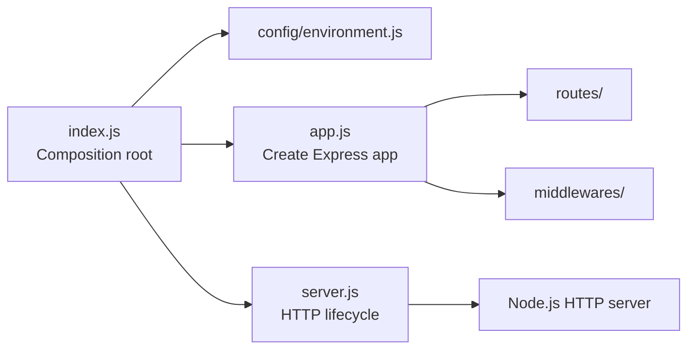
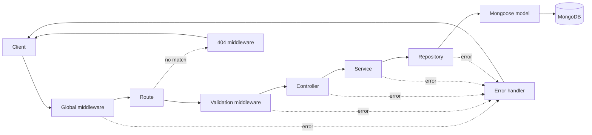
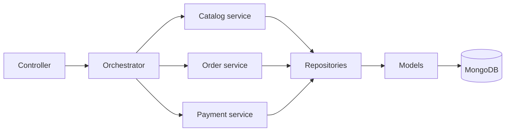

# Avengers API

The backend API for a MERN-stack e-commerce platform that sells licensed video
games, similar to Steam and the Epic Games Store.

The API is written in plain JavaScript, uses Express and native ECMAScript
modules, and runs on Node.js 24. The codebase follows a strict Layered
Architecture organized by technical responsibility.

## Technology Stack

- MongoDB for persistent data storage (planned)
- Express for the HTTP API
- React for the separate frontend application
- Node.js 24 for the backend runtime

## Requirements

- Node.js `>=24.11.0 <25`
- npm `>=11`

## Getting Started

Install the locked dependencies:

```sh
npm ci
```

Create a local environment file from the provided example:

```sh
cp .env.example .env
```

On Windows Command Prompt, use `copy .env.example .env` instead. The application
also runs without a `.env` file by using its default values.

Start the development server:

```sh
npm run dev
```

The API is available at `http://localhost:8000` by default.

## Environment Variables

| Variable | Default     | Description                      |
| -------- | ----------- | -------------------------------- |
| `HOST`   | `localhost` | Hostname used by the HTTP server |
| `PORT`   | `8000`      | Port used by the HTTP server     |

`PORT` must be an integer between `1` and `65535`.

## API Endpoints

| Method | Path | Description                     |
| ------ | ---- | ------------------------------- |
| `GET`  | `/`  | Returns a JSON welcome response |

## Available Scripts

All scripts are compatible with Windows, Ubuntu, and macOS.

| Command                                       | Description                                                                      |
| --------------------------------------------- | -------------------------------------------------------------------------------- |
| `npm start`                                   | Starts the application                                                           |
| `npm run dev`                                 | Starts the application with Nodemon and restarts after source changes            |
| `npm run lint`                                | Checks JavaScript files with ESLint                                              |
| `npm run lint:fix`                            | Fixes automatically repairable ESLint issues                                     |
| `npm run format`                              | Formats supported project files with Prettier                                    |
| `npm run format:check`                        | Checks formatting without modifying files                                        |
| `npm run commitlint -- --edit <message-file>` | Validates a commit message file                                                  |
| `npm run prepare`                             | Installs the project-managed Husky hooks; normally runs automatically on install |

## Development Workflow

Nodemon watches JavaScript and JSON files in `src`. Before every start or
restart, it runs ESLint and prints any errors in the development terminal. The
server starts only when linting succeeds. Staged JavaScript files are also
checked automatically before commits.

ESLint and Prettier provide static analysis and consistent formatting. The
configurations are located in `eslint.config.js` and `.prettierrc.json`.

ESLint also enforces the dependency direction between architectural layers
without additional plugins. Dynamic imports are prohibited because they can
bypass these static dependency restrictions.

### Naming Convention

- Use `kebab-case` filenames with a layer suffix, such as `home.controller.js`,
  `home.routes.js`, `game.service.js`, and `auth.middleware.js`.
- Use `camelCase` for functions, variables, and object instances, such as
  `getHome`, `createHomeRouter`, and `gameRepository`.
- Use `PascalCase` for classes, constructors, and Mongoose models, such as
  `AppError` and `Game`.
- Prefer named exports. A module may export multiple closely related functions;
  exports are named after their behavior rather than forced to match the
  filename.
- Keep conventional bootstrap and configuration filenames such as `index.js`,
  `app.js`, `server.js`, and `environment.js`.

## Architecture

The project uses a Layered Architecture organized by technical responsibility.
Layers are introduced when a feature needs them; simple endpoints do not need
empty service or repository abstractions.

### Application Bootstrap



`index.js` is the only executable composition root. It loads configuration,
builds the router and Express application, starts the HTTP server, and registers
shutdown handlers.

### HTTP Request Flow



A typical persisted use case follows this dependency direction:

```text
Route -> Controller -> Service -> Repository -> Model -> MongoDB
```

Routes attach middleware, validation, and controllers. Controllers handle the
HTTP boundary. Services implement use cases. Repositories isolate persistence,
and models define MongoDB schemas. A layer may be skipped when it adds no value;
for example, the current welcome endpoint only needs a route and controller.

### Complex Workflow

An orchestrator is optional and should only be introduced for a workflow that
coordinates several focused services, such as checkout or payment completion.



Each layer has one primary responsibility:

| Layer         | Responsibility                                                       |
| ------------- | -------------------------------------------------------------------- |
| Routes        | Declare endpoints and attach middleware, validation, and controllers |
| Controllers   | Translate HTTP requests and responses                                |
| Services      | Implement business rules and application use cases                   |
| Repositories  | Encapsulate database queries and persistence details                 |
| Models        | Define database schemas, indexes, and structural constraints         |
| Validations   | Validate request parameters, query strings, and request bodies       |
| Middlewares   | Implement reusable HTTP pipeline behavior                            |
| Orchestrators | Coordinate workflows that require multiple independent services      |
| Config        | Load and validate application configuration                          |
| Errors        | Define application errors and error-handling primitives              |
| Constants     | Store stable application-wide constants                              |
| Utils         | Provide small, stateless, reusable utilities                         |

### Dependency Rules

The following restrictions are enforced by ESLint:

- Routes cannot access services, repositories, or models directly.
- Controllers cannot depend on routes, repositories, or models.
- Services cannot depend on routes, controllers, or models.
- Repositories cannot depend on routes, controllers, or services.
- Models cannot depend on repositories or any higher layer.
- Validations cannot access business or persistence layers.
- Services must access stored data through repositories.
- Dynamic imports and duplicate imports are prohibited.

Services may compose other focused services when useful. Avoid circular service
dependencies, unnecessary layers, and modules that mix HTTP, business, and
persistence responsibilities.

## Git Hooks and Commit Messages

Husky manages the following Git hooks:

- `pre-commit` runs lint-staged, which applies ESLint and Prettier to staged
  files.
- `commit-msg` runs Commitlint against the commit message.

Commit messages must:

- Follow the Conventional Commits format.
- Contain exactly one line.
- Use English ASCII characters only.

Examples:

```text
feat: add game catalog endpoint
fix(checkout): prevent duplicate game purchase
docs: update setup instructions
```

## Project Structure

`routes/index.js` is the root router. It composes resource routers and is the
only route module imported by the application composition root. Future routers
such as `game.routes.js` and `order.routes.js` will be mounted there.

The following tree is the intended structure as the game-commerce API grows.
Files are examples of naming and placement; they should be added only when the
corresponding feature is implemented.

```text
avengers-api/
|-- .husky/
|   |-- commit-msg
|   `-- pre-commit
|-- src/
|   |-- config/
|   |   |-- database.js
|   |   `-- environment.js
|   |-- constants/
|   |   `-- order-status.js
|   |-- controllers/
|   |   |-- auth.controller.js
|   |   |-- game.controller.js
|   |   `-- order.controller.js
|   |-- errors/
|   |   `-- app-error.js
|   |-- middlewares/
|   |   |-- auth.middleware.js
|   |   |-- error-handler.middleware.js
|   |   `-- not-found.middleware.js
|   |-- models/
|   |   |-- game.model.js
|   |   |-- order.model.js
|   |   `-- user.model.js
|   |-- orchestrators/
|   |   `-- checkout.orchestrator.js
|   |-- repositories/
|   |   |-- game.repository.js
|   |   |-- order.repository.js
|   |   `-- user.repository.js
|   |-- routes/
|   |   |-- auth.routes.js
|   |   |-- game.routes.js
|   |   |-- home.routes.js
|   |   |-- order.routes.js
|   |   `-- index.js
|   |-- services/
|   |   |-- auth.service.js
|   |   |-- game.service.js
|   |   |-- order.service.js
|   |   `-- payment.service.js
|   |-- utils/
|   |   `-- pagination.js
|   |-- validations/
|   |   |-- auth.validation.js
|   |   |-- game.validation.js
|   |   `-- order.validation.js
|   |-- app.js
|   |-- index.js
|   `-- server.js
|-- .env.example
|-- .gitignore
|-- .prettierignore
|-- .prettierrc.json
|-- commitlint.config.js
|-- eslint.config.js
|-- nodemon.json
|-- package-lock.json
|-- package.json
`-- README.md
```

## License

This project is licensed under the MIT License.
