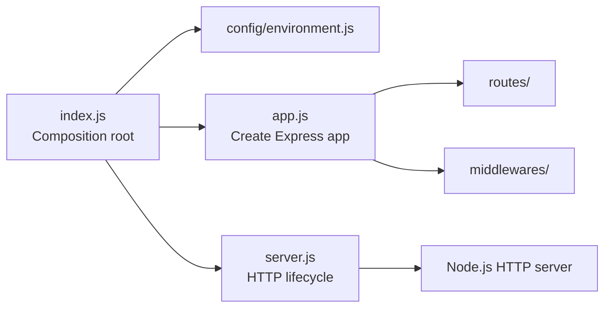
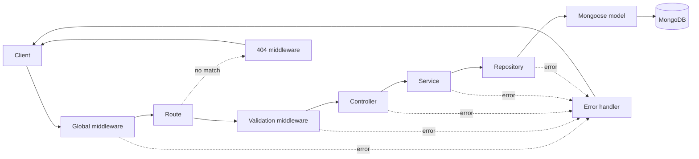
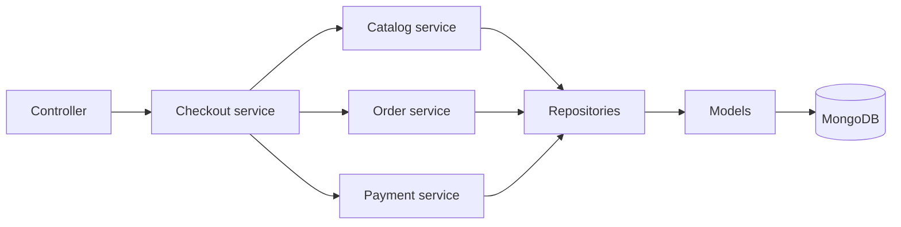

# Avengers API

The backend API for a MERN-stack e-commerce platform that sells licensed video
games, similar to Steam and the Epic Games Store.

The API is written in plain JavaScript, uses Express and native ECMAScript
modules, and runs on Node.js 24. The codebase follows a strict Layered
Architecture organized by technical responsibility.

## Database

The API connects to MongoDB Atlas with Mongoose using the driver defaults. Atlas
clusters are replica sets, so multi-document transactions are available without
extra configuration, and the driver already retries transient network failures.

The connection is opened before the HTTP server starts listening: if the cluster
is unreachable the process exits instead of serving traffic in a broken state.
On shutdown the connection is closed through the existing `onShutdown` hook, and
`/health/ready` reports the connection through a short `ping`.

Connection strings contain a password, so they are redacted from logs.

## Technology Stack

- MongoDB Atlas for persistent data storage
- Express for the HTTP API
- React for the separate frontend application
- Node.js 24 for the backend runtime

## Requirements

- Node.js `>=24.11.0 <25`
- npm `>=11`

## Getting Started

Install the locked dependencies:

```sh
npm ci
```

Create a local environment file from the provided example:

```sh
cp .env.example .env
```

On Windows Command Prompt, use `copy .env.example .env` instead. The application
also runs without a `.env` file by using its default values.

Start the development server:

```sh
npm run dev
```

The API is available at `http://localhost:8000` by default.

## Environment Variables

| Variable       | Default                  | Description                                               |
| -------------- | ------------------------ | --------------------------------------------------------- |
| `MONGODB_URI`  | required                 | MongoDB Atlas connection string                           |
| `NODE_ENV`     | `development`            | Either `development` or `production`                      |
| `HOST`         | `localhost`              | Hostname used by the HTTP server                          |
| `PORT`         | `8000`                   | Port used by the HTTP server                              |
| `LOG_LEVEL`    | `debug` / `info` in prod | Pino log level                                            |
| `CORS_ORIGINS` | empty                    | Comma-separated allowed origins; empty allows all origins |

`MONGODB_URI` is the only required variable. `PORT` must be an integer between
`1` and `65535`. Blank values are treated as missing and fall back to the
default.

Stack traces appear in error responses outside production and are always
suppressed when `NODE_ENV=production`.

Request timeouts are left to the Node.js HTTP server, which already aborts a
request after 300 seconds and incomplete headers after 60. `trust proxy` stays
at the Express default, so `X-Forwarded-For` is ignored and the real socket
address is used; enable it explicitly if the API is ever placed behind a reverse
proxy, otherwise clients can spoof their IP and bypass rate limiting.

## API Endpoints

Business endpoints are served under the `/api/v1` prefix. Health probes are
deliberately unversioned and exempt from rate limiting, because platform health
checks poll a fixed path and must never be throttled into a false negative.

| Method | Path            | Description                                    |
| ------ | --------------- | ---------------------------------------------- |
| `GET`  | `/api/v1`       | Returns a JSON welcome response                |
| `GET`  | `/health/live`  | Liveness: the process is running               |
| `GET`  | `/health/ready` | Readiness: dependencies usable; `503` when not |

## Available Scripts

All scripts are compatible with Windows, Ubuntu, and macOS.

| Command                                       | Description                                                                      |
| --------------------------------------------- | -------------------------------------------------------------------------------- |
| `npm start`                                   | Starts the application                                                           |
| `npm run dev`                                 | Starts the application with Nodemon and restarts after source changes            |
| `npm run lint`                                | Checks JavaScript files with ESLint                                              |
| `npm run lint:fix`                            | Fixes automatically repairable ESLint issues                                     |
| `npm run format`                              | Formats supported project files with Prettier                                    |
| `npm run format:check`                        | Checks formatting without modifying files                                        |
| `npm run commitlint -- --edit <message-file>` | Validates a commit message file                                                  |
| `npm run prepare`                             | Installs the project-managed Husky hooks; normally runs automatically on install |

## Error Handling

All errors are converted to JSON by a single error handler. Expected conditions
are represented by `AppError` subclasses in `src/errors/app-error.js`, such as
`NotFoundError`, `ValidationError`, and `ConflictError`. These carry an HTTP
status code and are considered operational, so their message is safe to return
to the client.

Any error that is not an `AppError` is treated as a programming fault and
reported as a generic `500` response; its details are logged but never exposed.
Stack traces are included only outside production.

Every error response has the same shape:

```json
{
  "success": false,
  "code": "NOT_FOUND",
  "message": "Game not found",
  "requestId": "0f7c1c2e-4a1e-4b8f-9a2f-6f0d2b1b7a55"
}
```

Clients must branch on `code`, never on `message`, because messages will change
and will eventually be translated. Codes are declared in
`src/constants/error-code.js`; a specific case may override the default, for
example
`new ConflictError('You already own this game', { code: 'GAME_ALREADY_OWNED' })`.

`requestId` is taken from the incoming `X-Request-Id` header when present and
generated otherwise. It is returned on every response header and inside every
error body, so a user report can be traced directly to the matching log entries.

Because Express 5 forwards rejected promises automatically, asynchronous
handlers can simply `throw` without a wrapper function.

## Security and Observability

The HTTP pipeline applies Helmet, CORS, compression, rate limiting, body-size
limits, and structured request logging with Pino before any route is reached.
Sensitive fields such as authorization headers, cookies, and passwords are
redacted from logs.

The server performs a graceful shutdown on `SIGINT` and `SIGTERM`: it stops
accepting new connections, waits for in-flight requests to finish, and then
closes the database connection. Unhandled promise rejections and uncaught
exceptions trigger the same controlled shutdown.

## Development Workflow

Nodemon watches JavaScript and JSON files in `src`. Before every start or
restart, it runs ESLint and prints any errors in the development terminal. The
server starts only when linting succeeds. Staged JavaScript files are also
checked automatically before commits.

ESLint and Prettier provide static analysis and consistent formatting. The
configurations are located in `eslint.config.js` and `.prettierrc.json`.

ESLint also enforces the dependency direction between architectural layers
without additional plugins. Dynamic imports are prohibited because they can
bypass these static dependency restrictions.

### Naming Convention

- Use `kebab-case` filenames with a layer suffix, such as `home.controller.js`,
  `home.routes.js`, `game.service.js`, and `auth.middleware.js`.
- Use `camelCase` for functions, variables, and object instances, such as
  `getHome`, `createHomeRouter`, and `gameRepository`.
- Use `PascalCase` for classes, constructors, and Mongoose models, such as
  `AppError` and `Game`.
- Prefer named exports. A module may export multiple closely related functions;
  exports are named after their behavior rather than forced to match the
  filename.
- Keep conventional bootstrap and configuration filenames such as `index.js`,
  `app.js`, `server.js`, and `environment.js`.

## Architecture

The project uses a Layered Architecture organized by technical responsibility.
Every request travels the same path through the layers, so the structure of an
endpoint never depends on how much work it happens to do.

### Application Bootstrap



`index.js` is the only executable composition root. It loads configuration,
builds the router and Express application, starts the HTTP server, and registers
shutdown handlers.

### HTTP Request Flow



A typical persisted use case follows this dependency direction:

```text
Route -> Controller -> Service -> Repository -> Model -> MongoDB
```

Routes attach middleware, validation, and controllers. Controllers handle the
HTTP boundary. Services implement use cases. Repositories isolate persistence,
and models define MongoDB schemas.

No layer is skipped. Even an endpoint as small as the welcome response goes
through a service, so that response data always originates below the HTTP
boundary. A layer with no persistence of its own simply stops earlier: the
welcome flow ends at its service because it has nothing to store.

The cost is a few thin modules; the benefit is that every endpoint is reached
the same way, so adding behaviour later never requires restructuring.

### Complex Workflow

A workflow that spans several concerns, such as checkout, is still an ordinary
service; it simply composes other focused services.



There is deliberately no separate orchestrator layer. Its only distinction from
a service would be calling several of them, which is a matter of degree rather
than responsibility, and the ambiguity tends to drain business rules out of the
services into a single procedural module.

Each layer has one primary responsibility:

| Layer        | Responsibility                                                       |
| ------------ | -------------------------------------------------------------------- |
| Routes       | Declare endpoints and attach middleware, validation, and controllers |
| Controllers  | Translate HTTP requests and responses                                |
| Services     | Implement business rules and application use cases                   |
| Repositories | Encapsulate database queries and persistence details                 |
| Models       | Define database schemas, indexes, and structural constraints         |
| Validations  | Validate request parameters, query strings, and request bodies       |
| Middlewares  | Implement reusable HTTP pipeline behavior                            |
| Config       | Load and validate application configuration                          |
| Errors       | Define application errors and error-handling primitives              |
| Constants    | Store stable application-wide constants                              |
| Utils        | Provide small, stateless, reusable utilities                         |

### Dependency Rules

The following restrictions are enforced by ESLint:

- Routes cannot access services, repositories, or models directly.
- Controllers cannot depend on routes, repositories, or models.
- Services cannot depend on routes, controllers, or models.
- Repositories cannot depend on routes, controllers, or services.
- Models cannot depend on repositories or any higher layer.
- Validations cannot access business or persistence layers.
- Middlewares cannot depend on routes, controllers, services, repositories, or
  models; they are HTTP infrastructure only.
- Services must access stored data through repositories.
- Routes, controllers, and services cannot read configuration directly; it is
  supplied by the composition root.
- Dynamic imports and duplicate imports are prohibited.

Services may compose other focused services when useful. Avoid circular service
dependencies, unnecessary layers, and modules that mix HTTP, business, and
persistence responsibilities.

### Composition

ESLint can only see static imports, so a dependency passed as an argument slips
past these rules. The convention is therefore that `index.js` is the only place
that wires layers together: it builds a repository, hands it to a service, hands
that service to a controller, and hands the controller to a router.

A module never receives something from more than one layer below it. A router
accepts a controller, never a service; a controller accepts a service, never a
repository. Configuration follows the same path, which is why `config/` holds
connection lifecycle and settings only, while a query such as the readiness
`ping` belongs in a repository.

## Git Hooks and Commit Messages

Husky manages the following Git hooks:

- `pre-commit` runs lint-staged, which applies ESLint and Prettier to staged
  files.
- `commit-msg` runs Commitlint against the commit message.

Commit messages must:

- Follow the Conventional Commits format.
- Contain exactly one line.
- Use English ASCII characters only.

Examples:

```text
feat: add game catalog endpoint
fix(checkout): prevent duplicate game purchase
docs: update setup instructions
```

## Project Structure

`routes/index.js` is the root router. It composes resource routers and is the
only route module imported by the application composition root. Future routers
such as `game.routes.js` and `order.routes.js` will be mounted there.

The following tree is the intended structure as the game-commerce API grows.
Files are examples of naming and placement; they should be added only when the
corresponding feature is implemented.

```text
avengers-api/
|-- .husky/
|   |-- commit-msg
|   `-- pre-commit
|-- src/
|   |-- config/
|   |   |-- database.js
|   |   `-- environment.js
|   |-- constants/
|   |   `-- order-status.js
|   |-- controllers/
|   |   |-- auth.controller.js
|   |   |-- game.controller.js
|   |   `-- order.controller.js
|   |-- errors/
|   |   `-- app-error.js
|   |-- middlewares/
|   |   |-- auth.middleware.js
|   |   |-- error-handler.middleware.js
|   |   `-- not-found.middleware.js
|   |-- models/
|   |   |-- game.model.js
|   |   |-- order.model.js
|   |   `-- user.model.js
|   |-- repositories/
|   |   |-- game.repository.js
|   |   |-- order.repository.js
|   |   `-- user.repository.js
|   |-- routes/
|   |   |-- auth.routes.js
|   |   |-- game.routes.js
|   |   |-- home.routes.js
|   |   |-- order.routes.js
|   |   `-- index.js
|   |-- services/
|   |   |-- auth.service.js
|   |   |-- checkout.service.js
|   |   |-- game.service.js
|   |   |-- order.service.js
|   |   `-- payment.service.js
|   |-- utils/
|   |   `-- pagination.js
|   |-- validations/
|   |   |-- auth.validation.js
|   |   |-- game.validation.js
|   |   `-- order.validation.js
|   |-- app.js
|   |-- index.js
|   `-- server.js
|-- .env.example
|-- .gitignore
|-- .prettierignore
|-- .prettierrc.json
|-- commitlint.config.js
|-- eslint.config.js
|-- nodemon.json
|-- package-lock.json
|-- package.json
`-- README.md
```

## License

This project is licensed under the MIT License.
